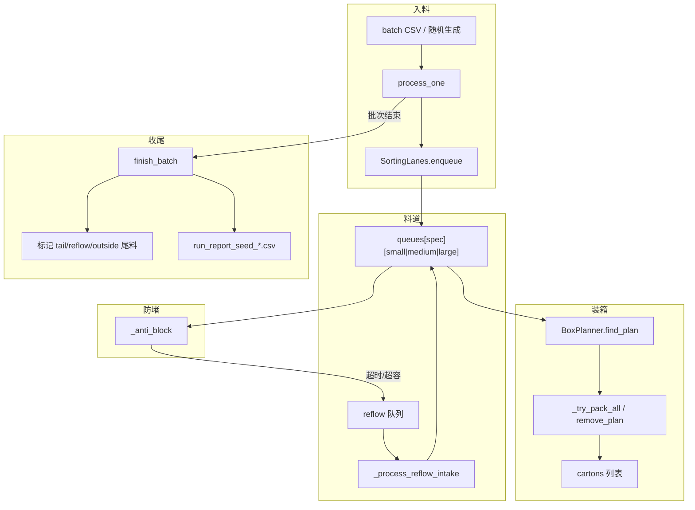

# Scheduler_Engine 模块说明

对应源码：[`src/Scheduler_Engine.py`](../src/Scheduler_Engine.py)

Web 可视化入口：[`src/web_server.py`](../src/web_server.py)（调用本模块的 `SchedulerEngine`）

---

## 一、模块做什么

本模块是 **智能分拣仿真引擎**，模拟一批鱼（默认 25000 条）从入料到装盒的全流程：

1. 从种子 CSV 或随机生成器读取鱼的数据（重量、规格）
2. 按规格 + 大/中/小分区，放入 **FIFO 料道**
3. 实时扫描能否凑满一盒（尾数 + 总重 4980–5030g）
4. 料道 **超时** 或 **超容** 时，队头鱼 **回流** 重新排队
5. 批次结束后统计成盒率、回流次数、尾料等，并导出 CSV 报告

与 [`plan/计算需求.py`](../plan/计算需求.py) 的区别：

| 模块 | 用途 |
|------|------|
| `计算需求.py` | 给定箱内已有重量，算「下一条鱼」可进区间（动态需求） |
| `Scheduler_Engine.py` | 完整流水线仿真：分区料道 + 组合装盒 + 回流 + 统计 |

---

## 二、依赖关系

启动时动态加载（不通过常规 `import`）：

| 模块 | 路径 | 用途 |
|------|------|------|
| `bucket_rules` | `plan/细分规则.py` | 各规格大/中/小重量分区、`bucket_of()` |
| `fish_seed_gen` | `plan/随机种子生成.py` | 生成/读取批次 CSV |

初始化时为 18 个规格预计算 `BUCKET_RANGES`（小/中/大重量区间）。

---

## 三、整体工作流程

### 3.1 主循环（每条鱼一个 tick）

```
run()
  └─ while process_one():
       ├─ tick += 1
       ├─ 从 batch 取一条 record → Fish
       ├─ lanes.enqueue()           入料道（或规格外队列）
       ├─ _process_reflow_intake()  回流鱼尝试重新入队
       ├─ _try_pack_all()           各规格扫描能否封箱
       ├─ _anti_block()             超时/超容 → 队头回流
       └─ _record_history()         记录时序快照

  finish_batch()                     批末扫尾、标记尾料、写 CSV
  print_report()                     控制台汇总
```

### 3.2 单条鱼入料分支

```
record.outside 或 无规格？
  ├─ 是 → outside 队列，status=unmatched_outside
  └─ 否 → 按 spec + bucket 入对应料道（FIFO 队尾），status=queued
```

### 3.3 封箱逻辑（BoxPlanner）

```
某规格料道总鱼数 >= min(counts)？
  └─ 枚举目标尾数 count（如 15p 的 7、8）
       └─ 枚举 small/medium/large 各取几条 (a,b,c)，a+b+c=count
            └─ 从各分区队头取前缀和，总重在 [4980,5030]？
                 └─ 选最接近 TARGET_MID(5005) 的方案封箱
                      └─ remove_plan() 从队头删除对应条数
```

### 3.4 回流机制

```
_anti_block() 按规格、分区扫描：
  1. 若该规格已能封箱 → 跳过（不回流）
  2. 若某分区 lane 长度 > capacity → 队头溢出回流 (overflow)
  3. 若队头 fish 停留 >= move_timeout 秒 → 超时回流 (timeout)

回流鱼进入 lanes.reflow，下一轮 _process_reflow_intake() 尝试重新入队
（若料道仍满则暂留 reflow 队列）
```

### 3.5 流程图



---

## 四、常量与配置

### 4.1 业务常量

| 名称 | 默认值 | 说明 |
|------|--------|------|
| `TARGET_MIN` / `TARGET_MAX` | 4980 / 5030 | 每盒目标总重（g） |
| `TARGET_MID` | 5005 | 封箱方案评分锚点（越接近越好） |
| `DEFAULT_TOTAL` | 25000 | 默认批次鱼数 |
| `DEFAULT_SEED` | 42 | 默认随机种子 |
| `DEFAULT_MOVE_TIMEOUT` | 30 | 队头鱼超时回流阈值（秒/tick） |
| `DEFAULT_CAP_FACTOR` | 8 | 料道容量系数 |

### 4.2 规格与模块

```python
SPECS = {
    "15p": {"range": (566, 700), "counts": (7, 8)},
    ...
}

MODULE_SPECS = {
    "A": ("15p", "20p", "25p", "30p", "35p", "40p"),
    "B": ("45p", "50p", "60p", "70p", "80p", "90p"),
    "C": ("100p", "110p", "120p", "130p", "140p", "150p"),
}
```

`MODULE_SPECS` 仅用于 **Web 快照分组展示**，不影响分拣逻辑。

### 4.3 分区

| 常量 | 说明 |
|------|------|
| `BUCKETS` | `("small", "medium", "large")` |
| `BUCKET_LABEL` | 显示用：`小/中/大` |
| `BUCKET_RANGES[spec]` | 各规格三区间的重量范围（启动时计算） |

### 4.4 料道容量公式

```python
lane_capacity(spec) = ceil(max(counts) * cap_factor / 3)
```

例：15p，`counts=(7,8)`，`cap_factor=8` → `ceil(8*8/3) = 22`（每个小/中/大分区各自上限）。

---

## 五、数据结构

### 5.1 `Fish` — 运行时鱼对象

| 字段 | 说明 |
|------|------|
| `id` | 鱼编号 |
| `weight` | 重量（g） |
| `spec` | 规格名，规格外为 `None` |
| `bucket` | `small` / `medium` / `large` |
| `enter_time` | 进入当前料道位置的 tick |
| `rounds` | 流转轮数（回流 +1） |

### 5.2 `FishTrace` — 追踪记录（写报告用）

| 字段 | 说明 |
|------|------|
| `first_in_time` | 首次入系统时间 |
| `outbound_time` | 装盒出站时间 |
| `dwell_time` | 停留时长（property） |
| `status` | `queued` / `packed` / `reflow` / `unmatched_*` |
| `reflow_reasons` | 回流原因列表（`timeout` / `overflow`） |

### 5.3 `BoxPlan` — 封箱方案

| 字段 | 说明 |
|------|------|
| `spec` | 规格 |
| `count` | 尾数 |
| `weight` | 盒总重 |
| `parts` | `{"small": a, "medium": b, "large": c}` |
| `fish` | 实际装盒的鱼列表（封箱后填充） |

### 5.4 `Stats` — 汇总计数

| 字段 | 说明 |
|------|------|
| `input_count` | 已入料条数 |
| `packed_fish` / `cartons` | 装箱鱼数 / 成盒数 |
| `outside_count` | 规格外鱼数 |
| `reflow_count` | 回流总次数 |
| `timeout_reflow` / `overflow_reflow` | 分项回流 |
| `unmatched_count` | 未匹配（尾料）总数 |
| `tail_count` | 批末尾料 |

---

## 六、工具函数（模块级）

| 函数 | 作用 |
|------|------|
| `_load_module(name, path)` | 动态加载 `plan/` 下脚本为模块 |
| `classify_spec(weight)` | 按重量归入 18 规格之一，无匹配返回 `None` |
| `classify_bucket(spec, weight)` | 在规格内再分 small/medium/large |
| `prefix_weights(fish_list)` | 前缀和数组，`[0, w1, w1+w2, ...]`，供组合枚举 |
| `lane_capacity(spec, cap_factor)` | 单分区料道容量上限 |
| `record_to_fish(record, tick)` | 种子 CSV 记录 → `Fish` 对象 |
| `load_or_generate_batch(seed, total, csv_path)` | 读 CSV；不存在则调用随机生成器并保存 |

**CSV 路径默认：** `data/fish_seed_{seed}.csv`

---

## 七、FishTracker — 鱼生命周期追踪

| 方法 | 作用 |
|------|------|
| `register(fish, tick, status)` | 首次入系统或更新轮数/状态 |
| `mark_packed(fish, tick)` | 装盒出站，`status=packed` |
| `mark_reflow(fish, tick, reason)` | 记录回流及原因 |
| `mark_unmatched(fish, status)` | 批末未装盒，`status=unmatched_tail` 等 |
| `save_report(path)` | 导出 `run_report_seed_*.csv` |

---

## 八、SortingLanes — 料道管理

维护结构：

```python
queues[spec][bucket]  # 各规格 × 大中小 的 FIFO 列表
outside[]             # 规格外
reflow[]              # 待重新入队
```

| 方法 | 作用 |
|------|------|
| `_put_in_lane(fish, tick)` | 内部：写入对应分区队尾，更新 `enter_time` |
| **`enqueue(fish, tick, tracker)`** | **主入队**：规格外 → outside；否则 → 料道 |
| **`try_enqueue_reflow(fish, tick, tracker)`** | 回流鱼重新入队；料道满则返回 `False` |
| `total_in_spec(spec)` | 某规格三区鱼总数 |
| **`remove_plan(plan, tick, tracker)`** | 按 `BoxPlan.parts` 从队头删除鱼并标记 packed |
| **`divert_head(spec, bucket, tick, reason, tracker)`** | 队头弹出 → reflow 队列，`rounds += 1` |
| `iter_lanes()` | 迭代 `(spec, bucket, lane_list)` |

**FIFO 原则：** 封箱、回流都操作 **队头**（`[:n]` 删除 / `pop(0)`）。

---

## 九、BoxPlanner — 装盒方案搜索

| 方法 | 作用 |
|------|------|
| **`find_plan(lanes, spec)`** | 在当前料道状态下，找最优 `BoxPlan` 或 `None` |

**搜索策略：**

1. 鱼数不足 `min(counts)` → 直接 `None`
2. 三重循环枚举 `(a, b, c)` = 从小/中/大各取几条
3. 用前缀和算总重，必须在 `[TARGET_MIN, TARGET_MAX]`
4. 评分 `score = abs(weight - TARGET_MID)`，纯单分区方案加惩罚 `+1.2`
5. 返回 score 最小的方案

> 修改装盒策略时，主要改 `find_plan()` 的枚举与评分逻辑。

---

## 十、SchedulerEngine — 调度引擎（核心类）

### 10.1 构造参数

| 参数 | 默认 | 说明 |
|------|------|------|
| `batch_records` | 自动加载 | 鱼批次数据 |
| `seed` | 42 | 种子号 |
| `interval` | 1.0 | 每条鱼间隔秒数（`run(realtime=True)` 时 sleep） |
| `specs` | 全部 18 规格 | 参与分拣的规格子集 |
| `move_timeout` | 30 | 超时回流阈值 |
| `cap_factor` | 8 | 料道容量系数 |
| `verbose` | False | 是否打印每条入料/封箱 |
| `log_every` | 500 | 进度日志间隔 |

### 10.2 内部状态

| 属性 | 说明 |
|------|------|
| `lanes` | `SortingLanes` 实例 |
| `planner` | `BoxPlanner` 实例 |
| `tracker` | `FishTracker` 实例 |
| `stats` | `Stats` 汇总 |
| `cartons` | 已封箱 `BoxPlan` 列表 |
| `tick` | 仿真时钟（秒） |
| `_cursor` | 批次读取指针 |
| `events` | 最近事件（最多 300 条，供 Web） |
| `history` | 时序统计（最多 500 条，供 Web） |

### 10.3 公开方法

| 方法 | 作用 |
|------|------|
| **`get_snapshot()`** | 返回 Web/API 用 JSON 快照（模块库存、统计、最近封箱、事件） |
| **`process_one()`** | **推进一步**：处理一条鱼 + 回流 + 封箱 + 防堵；返回是否还有鱼 |
| **`finish_batch()`** | 批末循环扫箱、标记尾料、写 CSV、`finished=True` |
| **`print_report()`** | 控制台打印汇总 |
| **`run(realtime=True)`** | 完整跑批：`process_one` 循环 → `finish_batch` → `print_report` |

### 10.4 内部方法

| 方法 | 作用 |
|------|------|
| `_event(kind, msg, **extra)` | 追加事件到 `events`（环形缓冲） |
| `_log(msg, force, kind, **extra)` | 写事件 + 可选控制台输出 |
| `_try_pack_all()` | 遍历所有 `specs`，能封则连续封，返回本 tick 封箱数 |
| `_process_reflow_intake()` | 处理 `reflow` 队列，能入则入料道 |
| `_anti_block()` | 超时/超容回流（每 tick 最多回流 1 条） |
| `_record_history()` | 按间隔写入 `history` |

### 10.5 `get_snapshot()` 返回结构（Web 用）

```python
{
    "tick", "finished", "seed", "total_fish",
    "input_count", "cartons", "packed_fish",
    "outside_count", "reflow_count", "timeout_reflow", "overflow_reflow",
    "unmatched_count", "tail_count",
    "reflow_queue", "outside_queue",
    "modules": {          # 按 A/B/C 分组
        "A": {"15p": {"small", "medium", "large", "total", "capacity"}, ...}
    },
    "recent_cartons": [...],   # 最近 8 盒
    "events": [...],           # 最近 40 条
    "history": [...],          # 最近 120 条
    "rounds_top": {...},       # 轮数分布
    "target": {"min": 4980, "max": 5030}
}
```

---

## 十一、入口函数

| 函数 | 作用 |
|------|------|
| **`run_demo(...)`** | 加载批次 → 创建引擎 → `run()` → 返回 `SchedulerEngine` |
| **`main()`** | CLI 入口，`argparse` 解析参数后跑批 |

### CLI 示例

```bash
# 默认：seed=42，25000 条，每条间隔 1s
python src/Scheduler_Engine.py

# 快速跑完（不 sleep）
python src/Scheduler_Engine.py --fast

# 详细日志 + 自定义超时
python src/Scheduler_Engine.py -v --move-timeout 20 --seed 100
```

| CLI 参数 | 说明 |
|----------|------|
| `--seed` | 随机种子 |
| `-n / --total` | 鱼总数 |
| `-i / --interval` | 每条间隔秒 |
| `--move-timeout` | 超时回流阈值 |
| `--csv` | 指定种子 CSV |
| `--fast` | 不等待实时 |
| `-v / --verbose` | 逐条打印 |
| `--log-every` | 进度间隔 |

---

## 十二、与 Web 服务集成

[`web_server.py`](../src/web_server.py) 中的 `SimulationRunner`：

```python
records = load_or_generate_batch(seed=seed, total=total)
engine = SchedulerEngine(batch_records=records, ...)
# 后台线程循环调用 engine.process_one()
# 前端轮询 engine.get_snapshot()
```

Web 端通过 `get_snapshot()` 读状态，**不直接操作** `SortingLanes`。

---

## 十三、输出文件

| 文件 | 生成时机 | 内容 |
|------|----------|------|
| `data/fish_seed_{seed}.csv` | 首次运行且无 CSV | 批次入参 |
| `data/run_report_seed_{seed}.csv` | `finish_batch()` | 每条鱼的追踪明细 |

报告字段：`fish_id, weight, spec, rounds, first_in_time, outbound_time, dwell_time, status, reflow_reasons`

---

## 十四、常见修改指南

### 14.1 改规格 / 尾数 / 盒重

改文件顶部 `SPECS`、`TARGET_MIN/MAX`（与 `计算需求.py` 保持一致即可）。

### 14.2 改大/中/小分区规则

改 [`plan/细分规则.py`](../plan/细分规则.py) 的 `calc_bucket_split()`；本模块启动时会重算 `BUCKET_RANGES`。

### 14.3 改封箱算法

改 `BoxPlanner.find_plan()`：

| 需求 | 改法 |
|------|------|
| 优先 8 尾而非 7 尾 | 在评分中加尾数权重 |
| 禁止纯单分区盒 | 增大 `a==0 or b==0 or c==0` 的惩罚 |
| 改用动态需求模块 | 在封箱前调用 `计算需求.py` 的 `check_incoming_fish` 替代组合搜索 |

### 14.4 改回流策略

改 `_anti_block()`：

| 需求 | 改法 |
|------|------|
| 关闭超时回流 | `move_timeout=0` 或在 `_anti_block` 跳过 timeout 分支 |
| 每 tick 回流多条 | 去掉 `return` 改为循环 |
| 调整料道容量 | 改 `cap_factor` 或 `lane_capacity()` 公式 |

### 14.5 只仿真部分规格

```python
SchedulerEngine(specs=("15p", "20p"), ...)
```

### 14.6 单步调试（不接 Web）

```python
from Scheduler_Engine import SchedulerEngine, load_or_generate_batch

records = load_or_generate_batch(seed=42, total=100)
engine = SchedulerEngine(batch_records=records, verbose=True, log_every=10)

while engine.process_one():
    snap = engine.get_snapshot()
    # 自定义观察 snap["modules"]["A"]["15p"]

engine.finish_batch()
engine.print_report()
```

### 14.7 程序化跑批（不要 sleep）

```python
engine = SchedulerEngine(...)
engine.run(realtime=False)   # 等同 run_demo(fast=True)
```

---

## 十五、类关系速查

```
SchedulerEngine
├── SortingLanes      料道队列 + 入队/回流/出队
├── BoxPlanner        组合搜索封箱方案
├── FishTracker       生命周期与 CSV 报告
└── Stats             计数器

工具链:
load_or_generate_batch → record_to_fish → SortingLanes.enqueue
                                       → BoxPlanner.find_plan
                                       → SortingLanes.remove_plan
```

---

## 十六、文件结构

```
Scheduler_Engine.py
├── 常量与配置       SPECS, MODULE_SPECS, TARGET_*, BUCKET_*
├── 动态加载         细分规则, 随机种子生成 → BUCKET_RANGES
├── 数据模型         Fish, FishTrace, BoxPlan, Stats
├── 工具函数         classify_*, prefix_weights, lane_capacity, load_or_generate_batch
├── FishTracker      追踪与报告
├── SortingLanes     料道 FIFO
├── BoxPlanner       装盒搜索
├── SchedulerEngine  主引擎
└── run_demo / main  入口
```

---

## 十七、相关文档

- 业务背景：[`md/智能分拣系统.md`](智能分拣系统.md)
- 动态需求计算：[`md/计算需求说明.md`](计算需求说明.md)
- 大中小分区：[`plan/细分规则.py`](../plan/细分规则.py)
- 批次数据生成：[`plan/随机种子生成.py`](../plan/随机种子生成.py)
