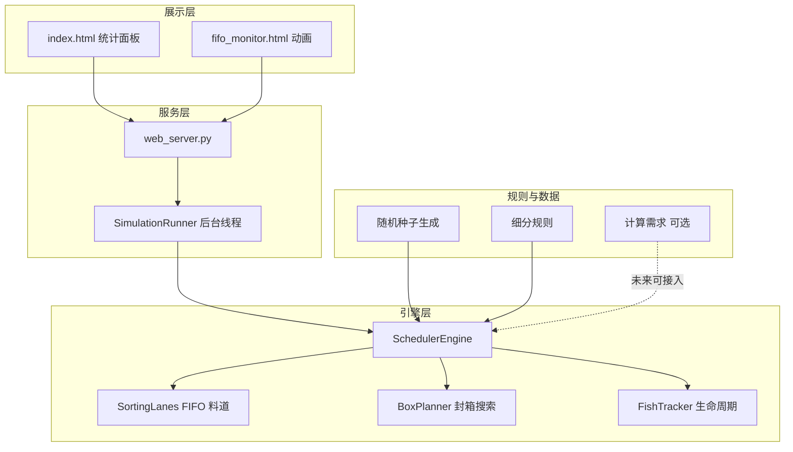

# 智能分拣系统说明书

> 本文档基于业务需求 [`智能分拣系统.md`](智能分拣系统.md) 与当前程序实现编写，适用于开发、调试与现场仿真验证。  
> 技术细节可进一步查阅：[`Scheduler_Engine说明.md`](Scheduler_Engine说明.md)、[`计算需求说明.md`](计算需求说明.md)。

---

## 1. 系统概述

### 1.1 系统定位

本系统是一套 **鱼类智能分拣与装箱仿真平台**，用于在软件环境中复现（并验证）如下产线逻辑：

1. 一批鱼按重量进入流水线（默认 **25000 条/批**）；
2. 按 **18 个成品规格**（15p～150p）分类；
3. 每个规格内再按 **小 / 中 / 大** 重量分区进入 **FIFO 料道**；
4. 实时组合凑满一盒（约 **5 kg**，4980～5030 g，尾数按规格规则）；
5. 料道 **超时** 或 **超容** 时队头鱼 **回流** 重排；
6. 批末统计成盒率、尾料、回流，并通过 **Web 可视化** 监控全过程。

系统既可 **命令行快速跑批**，也可通过 **浏览器动画 + 统计面板** 观察策略效果，为产线参数调优提供依据。

### 1.2 适用场景

| 场景 | 说明 |
|------|------|
| 策略验证 | 调整超时、料道容量、启用规格后对比成盒率与尾料 |
| 培训演示 | FIFO 动画页展示进料、需求广播、装箱工位状态 |
| 数据分析 | 导出成盒明细、尾料原因、全批次鱼生命周期 CSV |
| 算法对照 | 与 `plan/计算需求.py` 动态需求算法、国轩样例算法对比 |

### 1.3 系统边界

- **已实现**：批次仿真、分区 FIFO、组合封箱、回流防堵、Web 监控、CSV 报告。
- **独立模块**：`plan/计算需求.py` 提供「下一条鱼可进重量区间」计算，供需求广播或未来接入闸门逻辑；**当前封箱引擎使用组合搜索**，未与其强制绑定。
- **非目标**：本程序为仿真与可视化，不直接控制 PLC/硬件。

---

## 2. 业务规则

### 2.1 流水线总流程

```
随机生成鱼重量（种子可复现）
        ↓
称重 → 归入 18 规格之一（或规格外）
        ↓
规格内按小/中/大进入对应 FIFO 料道
        ↓
扫描能否凑满一盒（4980～5030 g）
        ↓
封箱 / 或 超时·超容 → 队头回流
        ↓
批末扫尾 → 成盒统计 + 尾料记录
```

### 2.2 批次入参

| 项目 | 默认值 | 说明 |
|------|--------|------|
| 总条数 | 25000 | 可在 Web/CLI 修改 |
| 随机种子 | 42 | 相同种子 + 相同启用规格 → 可复现同一批次 |
| 规格外比例 | 约 1% | 重量 **&lt; 65 g 或 &gt; 700 g** 的真规格外鱼 |
| 有效重量带 | 65～700 g | 规格内鱼在该范围内按规格表划分 |

启用规格可在监控页勾选；未启用规格 **不生成批次鱼**，动画与引擎均不进入对应料道。批次 CSV 文件名带启用标签，例如：`fish_seed_42_en_60p-70p-100p.csv`。

### 2.3 成品规格表（程序实现）

下表为 `Scheduler_Engine.py` / `计算需求.py` 中实际使用的规则（18 档）。业务文档中「50p」重复一行，程序以 **45p** 与 **50p** 两档区分。

| 规格 | 单条重量 (g) | 每盒允许尾数 | 模块 |
|------|-------------|-------------|------|
| 15p | 566～700 | 7、8 | A |
| 20p | 446～565 | 10、11 | A |
| 25p | 366～445 | 12、13、14 | A |
| 30p | 306～365 | 15、16 | A |
| 35p | 266～305 | 17、18、19 | A |
| 40p | 231～265 | 20、21 | A |
| 45p | 211～230 | 22、23 | B |
| 50p | 183～210 | 25、26 | B |
| 60p | 153～182 | 30、31 | B |
| 70p | 133～152 | 35、36 | B |
| 80p | 116～132 | 40、41 | B |
| 90p | 106～115 | 45、46 | B |
| 100p | 96～105 | 50、51 | C |
| 110p | 87～95 | 55、56 | C |
| 120p | 80～86 | 60、61 | C |
| 130p | 74～79 | 65、66 | C |
| 140p | 69～73 | 70、71 | C |
| 150p | 65～68 | 75、76 | C |

### 2.4 装盒目标（以 15p 为例）

业务要求（[`智能分拣系统.md`](智能分拣系统.md) 第四节）在程序中泛化为全部规格：

| 项目 | 规则 |
|------|------|
| 单条重量 | 落在该规格 `range` 内 |
| 每盒总重 | **4980～5030 g**（约 5 kg） |
| 每盒尾数 | 取该规格 `counts` 中某一档（如 15p 为 7 或 8 尾） |
| 分区搭配 | 小/中/大 FIFO 队头组合，优先总重接近 5005 g |

> 说明：在 566～700 g 限制下，15p **7 尾** 理论最大约 4900 g，难以稳定达到 4980 g；仿真中 **8 尾** 方案更常达标。中区划分亦按主力尾数（counts 中间值）锚定。

### 2.5 小 / 中 / 大重量分区

分区算法定义在 [`plan/细分规则.py`](../plan/细分规则.py)，引擎启动时预计算 `BUCKET_RANGES`，Web 动画通过 `/api/config` 同步。

**原则**：以主力尾数 `primary_count`（一般为 `counts` 中间项）锚定 **中区**，使 `primary_count` 尾纯中区重量能落在 4980～5030 g。

**15p 示例**（`primary_count = 8`）：

| 区段 | 重量 (g) | 说明 |
|------|----------|------|
| 小 | 566～621 | 规格下限至中区前 |
| 中 | 622～628 | 8 尾 ≈ 4976～5024 g |
| 大 | 629～700 | 中区后至规格上限 |

**修改分区**：只改 `plan/细分规则.py`（或规格 `range`/`counts`），重启 `web_server.py` 后全链路生效。

---

## 3. 系统架构

### 3.1 目录结构

```
kaomam_project/
├── plan/                      # 规则与数据生成
│   ├── 随机种子生成.py         # 批次 CSV
│   ├── 细分规则.py             # 小/中/大划分
│   └── 计算需求.py             # 动态需求（独立能力）
├── src/
│   ├── Scheduler_Engine.py    # 核心仿真引擎
│   ├── web_server.py          # HTTP 服务 + 后台线程
│   ├── index.html             # 统计监控面板
│   ├── fifo_monitor.html      # FIFO 动画监控
│   └── start_web.bat          # Windows 启动脚本
├── data/                      # 批次与报告 CSV
└── md/                        # 文档（含本说明书）
```

### 3.2 逻辑分层



### 3.3 核心类职责

| 类 / 模块 | 职责 |
|-----------|------|
| `SchedulerEngine` | 主循环：入料、回流、封箱、防堵、快照、批末收尾 |
| `SortingLanes` | 18 规格 × 3 分区 FIFO 队列，入队/出队/回流 |
| `BoxPlanner` | 枚举小中大组合，选最接近 5005 g 且达标的封箱方案 |
| `FishTracker` | 每条鱼状态、回流原因、成盒/尾料追踪与 CSV |
| `SimulationRunner` | Web 启停、倍速、线程安全快照 |
| `DemandEngine` | 18 箱动态需求（`计算需求.py`，并行能力） |

---

## 4. 分拣与装箱逻辑

### 4.1 主循环（每条鱼一个 tick）

```
process_one()
  ├─ 从批次取下一条鱼
  ├─ 按规格 + 小/中/大入料道（未启用规格 → 规格外）
  ├─ 处理回流队列，尝试重新入队
  ├─ 遍历启用规格，能封则连续封箱
  ├─ 防堵：超容 / 超时 → 队头回流（每 tick 最多 1 条）
  └─ 记录时序快照（供 Web 图表）
```

### 4.2 封箱算法（BoxPlanner）

1. 某规格三区鱼总数 ≥ `min(counts)` 才尝试；
2. 三重循环枚举从小/中/大各取几条，总和 = 目标尾数（**三区均可参与，不限于小+大**）；
3. 用队头前缀和算总重，必须在 [4980, 5030]；
4. 评分 `|总重 − 5005|`，纯单分区或缺区方案加惩罚（+1.2）；
5. 选最优方案，从队头删除对应鱼并记为已装箱。

> 配盒组合与 FIFO 取鱼细节见 **§10.3**。

### 4.3 回流机制

引擎运行期写入 `reflow_reasons` 的原因仅有 **`overflow`（超容）** 与 **`timeout`（超时）** 两种（见 **§10.1**）。

| 触发条件 | 行为 |
|----------|------|
| 某分区长度 &gt; 料道容量 | 队头溢出回流 `overflow` |
| 队头停留 ≥ `move_timeout` 秒 | 超时回流 `timeout` |
| 该规格已能封箱 | 当 tick 不回流该规格（避免堵死成盒） |

> 超时起算与 `enter_time` 重置规则见 **§10.2**。

料道容量公式（每分区）：

```
capacity = ceil(max(counts) × cap_factor / 3)    # 默认 cap_factor = 8
```

### 4.4 动态需求（扩展能力）

[`plan/计算需求.py`](../plan/计算需求.py) 根据 **箱内已有重量** 计算「下一条鱼」可接受重量区间，支持：

- 单箱计算：`BoxDemandCalculator`
- 18 箱并行：`DemandEngine.calc_all_active()`

业务文档第五节「计算需求类」对应该模块。FIFO 页 **需求地址广播** 为动画层逻辑；若要与真实 PLC 一致，可将引擎封箱前判定改为调用 `check_incoming_fish`。

---

## 5. 安装与运行

### 5.1 环境要求

- Python 3.10+（项目使用 3.10）
- 无第三方依赖（标准库：`http.server`、`csv`、`threading` 等）

### 5.2 启动 Web 可视化（推荐）

```bash
cd kaomam_project
python src/web_server.py
```

或双击 `src/start_web.bat`。

| 地址 | 页面 | 用途 |
|------|------|------|
| http://127.0.0.1:8765/ | 统计监控 | 入料进度、模块库存、成盒/尾料、趋势图 |
| http://127.0.0.1:8765/monitor | FIFO 动画 | 进料动画、54 路需求、装箱工位、启用规格 |

端口可通过环境变量 `WEB_PORT` 修改。

### 5.3 命令行跑批

```bash
python src/Scheduler_Engine.py              # 默认 seed=42, 25000 条
python src/Scheduler_Engine.py --fast       # 不 sleep，快速跑完
python src/Scheduler_Engine.py -v --seed 100 --move-timeout 20
```

### 5.4 典型操作顺序

1. 打开 `/monitor`，勾选 **启用规格**，设置种子/条数/倍速；
2. 点 **开始**（或先在 `/` 统计页开始，两页状态同步）；
3. 观察入料进度、模块库存、装箱工位与需求列表；
4. 批末在统计页点 **成盒数据** / **尾料数据** 查看或导出 CSV；
5. **下载报告** 获取全批次每条鱼追踪明细。

---

## 6. Web 界面说明

### 6.1 统计监控页（`/`）

| 区域 | 内容 |
|------|------|
| 控制栏 | 种子、总条数、移动超时、倍速、启停 |
| 统计卡片 | 模拟时间、入料、装盒数、装箱鱼数、回流、规格外、尾料 |
| 趋势图 | 入料 / 装盒 / 回流随时间变化 |
| 模块面板 | A/B/C 各规格小/中/大库存与容量（未启用规格半透明显示） |
| 成盒数据 | 弹窗表格：每盒每条鱼 ID·重量·分区 |
| 尾料数据 | 弹窗表格：尾料原因、是否曾超时/超容、停留时间 |

### 6.2 FIFO 动画页（`/monitor`）

| 区域 | 内容 |
|------|------|
| 启用规格 | 勾选参与仿真的规格；切换后重新加载批次 |
| 画布 | 进料口 → 称重 → 需求匹配 → 三模块料道 → 装箱工位 |
| 需求广播 | 地址格式 `模块/规格/区段`，如 `A/15p/light`（light=小） |
| 装箱工位 | 18 规格状态：空闲 / 待装箱 / 进箱中 / 填箱中 / 封箱中 |
| 统计标签页 | 内嵌统计面板（`/?embed=1`），同页切换不丢动画 |

**双页同步**：共用 `SimulationRunner` 与 `/api/state`；入料进度 `input_count`、启停状态一致；动画按服务器 `input_count` 逐条进料，不批量补历史鱼。

### 6.3 活跃需求路数

全启用时为 **54 路**（18 规格 × 小/中/大）。未启用规格在需求列表中标记「未启用」，不参与批次生成与料道动画。

---

## 7. 数据与报告

### 7.1 输入文件

| 文件 | 说明 |
|------|------|
| `data/fish_seed_{seed}.csv` | 全规格默认批次 |
| `data/fish_seed_{seed}_en_{规格列表}.csv` | 按启用规格生成的批次 |

字段：`id, weight, spec, outside`

### 7.2 批末输出

| 文件 | 内容 |
|------|------|
| `cartons_seed_{seed}.csv` | 成盒明细：箱号、规格、尾数、总重、分区条数、每条鱼 ID/重量/分区 |
| `remaining_seed_{seed}.csv` | 尾料：鱼 ID、重量、尾料原因、回流记录、停留时间 |
| `run_report_seed_{seed}.csv` | 全批次每条鱼：入站/出站时间、状态、回流原因 |

### 7.3 尾料原因解读

| 字段 | 含义 |
|------|------|
| `tail_cause` | **批末**未配盒主因：料道剩余 / 回流未再入盒 / 规格外 |
| `had_timeout` | 仿真过程中是否曾因 **超时** 被弹出料道 |
| `had_overflow` | 是否曾因 **超容** 被弹出料道 |
| `reflow_summary` | 上述回流记录的文字汇总 |

分析建议：先看 `tail_cause` 判断最终落在哪类尾料；再结合 `had_timeout` / `had_overflow` 判断是「一直凑不齐盒」还是「被回流策略打断」。

### 7.4 API 摘要

| 方法 | 路径 | 说明 |
|------|------|------|
| GET | `/api/state` | 运行快照（核心） |
| GET | `/api/config` | 默认参数、规格表、`bucket_ranges` |
| GET | `/api/batch` | 种子批次（动画用，需带 `enabled_specs`） |
| GET | `/api/cartons` | 成盒 JSON |
| GET | `/api/remaining` | 尾料 JSON |
| GET | `/api/report` | 全量追踪 CSV |
| POST | `/api/start` | 开始 `{seed, total, move_timeout, speed, enabled_specs}` |
| POST | `/api/pause` / `resume` / `stop` / `speed` | 控制仿真 |

---

## 8. 参数调优指南

| 参数 | 位置 | 调大效果 | 调小效果 |
|------|------|----------|----------|
| `move_timeout` | Web / CLI | 队头更久才回流，料道更易堆积 | 更频繁超时回流，成盒机会可能下降 |
| `cap_factor` | 引擎构造 | 料道容量增大，溢出回流减少 | 更易 overflow 回流 |
| `enabled_specs` | 监控页 | 更多规格并行，尾料结构更复杂 | 聚焦单模块验证 |
| `speed` | Web | 仅影响动画与线程 sleep，不改变逻辑结果 | — |
| 盒重上下限 | `TARGET_MIN/MAX` | 需同时改 `细分规则.py`、`计算需求.py` | — |

---

## 9. 常见问题

**Q：取消部分规格后仍有该规格的鱼进料道？**  
A：需重启服务后，在 `/monitor` 重新勾选并 **重置/重载批次**；`/api/batch` 须带正确 `enabled_specs`，否则曾误用默认 15p～40p 批次（已修复逗号解析）。

**Q：动画与统计页入料数不一致？**  
A：两页须通过同一 `web_server` 启动；动画不补历史，只跟 `input_count` 向前。

**Q：如何改小/中/大克数区间？**  
A：只改 `plan/细分规则.py`，重启服务；刷新监控页，日志会打印示例区间。

**Q：成盒率偏低怎么办？**  
A：查看尾料汇总与 `run_report`；尝试增大 `move_timeout` 或 `cap_factor`，或减少并行规格做对照实验。

---

## 10. 补充说明（回流 · 超时 · 配盒）

本节对应 `Scheduler_Engine.py` 当前实现，说明仿真引擎中与 FIFO 料道、防堵回流、封箱搜索相关的常见疑问。

### 10.1 回流有哪些原因？

运行过程中，鱼被弹出料道进入 `reflow` 队列时，`FishTracker.mark_reflow()` 会记录原因字符串。**仅有以下两种**（均在 `_anti_block()` → `divert_head(..., reason)` 中触发）：

| 原因代码 | 含义 | 触发条件 |
|----------|------|----------|
| **`overflow`** | 超容回流 | 某规格、某分区（小/中/大）料道长度 **大于** 容量上限 `lane_capacity(spec)`，弹出该分区 **队头** 鱼 |
| **`timeout`** | 超时回流 | 某规格、某分区 **队头** 鱼停留时间达到 `move_timeout`，且该规格此刻 **`find_plan` 仍不能封箱** |

**前置条件（两种回流共用）**：`_anti_block()` 扫描某规格时，若 `BoxPlanner.find_plan()` 已能封箱，则 **跳过** 该规格的本 tick 防堵（避免把即将成盒的鱼回流掉）。

**每 tick 上限**：全规格、全分区扫描中，**最多回流 1 条**鱼（`return` 退出）。

**与「回流」相关但不算新原因的状态**：

| 状态 / 队列 | 说明 |
|-------------|------|
| `reflow` 队列 | 被弹出后的暂存区；每 tick `_process_reflow_intake()` 尝试重新进入料道 |
| `unmatched_reflow` | **批末**仍留在 `reflow` 队列、未能再装盒 → 记入尾料，非运行期第三种 reason |
| `outside` | 真规格外或未启用规格，**不进料道，不计入回流** |
| `move_timeout = 0` | 关闭超时回流，仅保留超容回流 |

同一条鱼可多次回流，`reflow_reasons` 会累积，例如 `timeout|overflow|timeout`。尾料报表中的 `had_timeout` / `had_overflow` 即根据该列表统计。

**说明**：`fifo_monitor.html` 动画页中的 `fifoReflow`、`overflow` 等为 **前端演示统计**，与后端 `stats.reflow_count` / `timeout_reflow` / `overflow_reflow` 不是同一套计数。

### 10.2 超时如何计算？

#### `tick` 与仿真时间

- 每处理 **1 条入料鱼**，`process_one()` 执行一次，`tick += 1`。
- 在引擎语义下 **1 tick ≈ 1 秒**（Web 倍速只影响后台线程 `sleep`，不改变「每条鱼一个 tick」的计数关系）。

#### `enter_time` 何时写入 / 重置

| 时机 | 代码行为 |
|------|----------|
| 鱼进入某分区料道队尾 | `_put_in_lane()` → `fish.enter_time = tick` |
| 鱼被 `divert_head` 弹出到 `reflow` | 弹出时再次 `fish.enter_time = tick` |
| 鱼从 `reflow` 重新入队 | 再次 `_put_in_lane()`，**重新** `enter_time = tick` |

#### 判定公式

仅针对 **该分区 FIFO 的队头** `lane[0]`：

```
tick - lane[0].enter_time >= move_timeout
```

且需 `move_timeout > 0`。

#### 常见误解澄清

| 说法 | 实际行为 |
|------|----------|
| 「鱼一进系统就开始永久计时」 | **否**。计时锚定在 **进入当前分区料道队尾**（或弹出到 reflow）时的 `enter_time`，回流入队后会 **重置** |
| 「成为队头才开始计时」 | **否**。`enter_time` 在 **入队尾** 时已设定；排在后面的鱼在等候前移期间时钟已在走，轮到队头时可能已接近或超过阈值 |
| 「任意位置的鱼都会因超时被弹出」 | **否**。仅 **队头** 鱼参与超时判定；后方鱼须等前方鱼装走或回流后依次前移 |

#### 与统计页参数的关系

Web 统计页 / FIFO 页的「移动超时」传入引擎 `move_timeout`；设为 `0` 可完全关闭超时回流，仅保留超容防堵。

### 10.3 FIFO 料道如何配盒？

封箱由 `BoxPlanner.find_plan()` 完成：**小、中、大三个分区均参与组合**，并非「只允许小号 + 大号」配比；中号鱼可以与小号、大号任意搭配，也可不参与（某一区取 0 条）。

#### 算法步骤

1. 该规格三区鱼总数 ≥ `min(counts)`（如 15p 至少 7 条）才尝试；
2. 枚举目标尾数 `count`（如 15p 取 7 或 8）；
3. 三重循环 `(a, b, c)`：
   - `a` = 从 **小区** 队头连续取几条  
   - `b` = 从 **中区** 队头连续取几条  
   - `c` = 从 **大区** 队头连续取几条  
   - 约束：`a + b + c = count`
4. 用各区 **队头前缀和** 计算总重，须在 **[4980, 5030] g**；
5. 评分 `score = |总重 − 5005|`；若 `a==0` 或 `b==0` 或 `c==0`（纯单区或缺少某一区），`score += 1.2`，倾向三区都有鱼的方案；
6. 取 `score` 最小方案，按 `parts` 从各区队头删除对应条数并封箱。

#### 15p、8 尾示例（均为合法搭配，须总重达标且队头鱼足够）

| 小 a | 中 b | 大 c | 说明 |
|------|------|------|------|
| 2 | 3 | 3 | 三区混合 |
| 0 | 8 | 0 | 纯中区 8 尾，允许但有 +1.2 惩罚 |
| 5 | 0 | 3 | 仅小+大，**中号不参与** |
| 8 | 0 | 0 | 纯小区，允许但有惩罚 |

#### FIFO 原则

- 小 / 中 / 大各自独立 FIFO 队列；
- 配盒只从各区 **队头连续取** `a`、`b`、`c` 条（前缀和），**不会**跳过队头去挑后面更「合适」的鱼。

#### 与动画页的关系

`fifo_monitor.html` 内含类似的 `a/b/c` 枚举逻辑，用于 **可视化演示**；成盒统计、CSV 报告以 **`Scheduler_Engine.BoxPlanner`** 为准。

---

## 11. 相关文档索引

| 文档 | 说明 |
|------|------|
| [`智能分拣系统.md`](智能分拣系统.md) | 原始业务需求摘要 |
| [`Scheduler_Engine说明.md`](Scheduler_Engine说明.md) | 引擎类、方法、修改指南 |
| [`计算需求说明.md`](计算需求说明.md) | 动态需求算法与 API |
| [`src/web_server.py`](../src/web_server.py) 文件头 | Web 工作流程与 API 说明 |
| [`guoxuan样例/`](../guoxuan样例/) | 另一套 DFS 装箱参考实现 |

---

## 12. 版本与维护

- Web 服务版本见 `GET /api/version`（`web_server.SERVER_VERSION`）。
- 规格表、盒重、分区规则以 `Scheduler_Engine.py` 与 `plan/细分规则.py` 为准；业务表格与程序不一致时，**以程序为准** 并回写业务文档。

*文档版本：与当前代码库同步（含启用规格批次、bucket_ranges 同步、成盒/尾料明细增强、§10 回流/超时/配盒补充说明）。*
