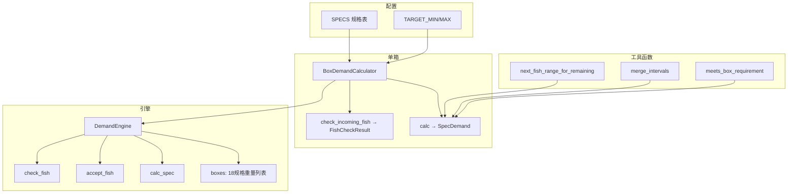

# 计算需求模块说明

对应源码：[`plan/计算需求.py`](../plan/计算需求.py)

---

## 一、模块做什么

本模块用于 **18 规格分拣装箱** 场景，核心能力有两块：

1. **动态需求计算**：根据箱内已有鱼的重量，算出「下一条鱼」可接受的重量区间。
2. **进鱼判定**：来一条新鱼时，判断能不能进这个箱（先算需求，再比对重量）。

业务目标（以 15p 为例）：

| 项目 | 规则 |
|------|------|
| 单条重量 | 566–700g（各规格不同，见 `SPECS`） |
| 每箱尾数 | 7 或 8 尾 |
| 每箱总重 | 4980–5030g（约 5kg） |

---

## 二、整体流程

### 2.1 仅查询：当前箱还需要什么鱼

```
箱内已有重量列表 weights
        │
        ▼
BoxDemandCalculator(spec, weights).calc()
        │
        ├─ 已达标？ → 返回 complete=True，next_fish_ranges=[]
        ├─ 空箱？   → 按各目标尾数算首条可进区间
        └─ 未达标   → 遍历 allowed_counts，逐方案算下一条区间
                        │
                        ▼
              merge_intervals() 合并多方案区间
                        │
                        ▼
              返回 SpecDemand（含 next_fish_ranges）
```

### 2.2 进鱼判定：incoming 鱼能不能进

```
incoming 鱼 (spec, weight)
        │
        ▼
check_incoming_fish(weight)   ← 基于【进鱼前】的箱内状态
        │
        ├─ 1. weight 不在规格 range？        → 不可进
        ├─ 2. 箱已达标？                     → 不可进
        ├─ 3. weight 落在 next_fish_ranges？ → 可进
        └─ 4. 加入后 meets_requirement？     → 可进（直接凑满）
        │
        ▼
返回 FishCheckResult（acceptable=True/False）
```

### 2.3 多规格并行（引擎）

```
DemandEngine 维护 18 个规格的 boxes 字典
        │
        ├─ calc_spec / calc_all        → 查各箱动态需求
        ├─ check_fish(spec, weight)    → 18 箱分别判定（仅同规格箱做真实计算）
        ├─ accept_fish(spec, weight)   → 判定通过才写入 boxes
        └─ add_fish(spec, weight)      → 无条件写入（判定结果仅供参考）
```

---

## 三、核心算法：下一条鱼重量怎么算

函数：`next_fish_range_for_remaining()`

**输入：**

| 参数 | 含义 |
|------|------|
| `rem_min / rem_max` | 还需凑够的总重区间 = `[TARGET_MIN - 当前总重, TARGET_MAX - 当前总重]` |
| `remaining_count` | 还需几条鱼（**含即将进来的这条**） |
| `spec_lo / spec_hi` | 该规格单条鱼的重量上下限 |

**逻辑：**

- 若只剩 1 条：下一条重量必须在 `[rem_min, rem_max]` 与 `[spec_lo, spec_hi]` 的交集中。
- 若还需 k+1 条（k 为下一条之后的条数）：假设其余 k 条各在 `[spec_lo, spec_hi]`，反推下一条 w 的范围：
  - `w_lo = max(spec_lo, rem_min - k * spec_hi)`
  - `w_hi = min(spec_hi, rem_max - k * spec_lo)`
  - 再与规格区间取交集。

**多方案合并：**

同一规格允许多种目标尾数（如 15p 的 7 尾、8 尾），每种尾数各算一个区间，最后由 `merge_intervals()` 合并成 `next_fish_ranges`。

**示例（15p，已进 5 条，总重 3091g）：**

```
目标 8 尾 → 还需 3 条 → 剩余重 1889–1939g
  → 下一条可进 [566, 700]g
目标 7 尾 → 还需 2 条 → 剩余重 1889–1939g
  → 下一条需 ≥1189g，超出规格上限 → 无有效区间
合并结果 → next_fish_ranges = [(566, 700)]
incoming 650g → 落在区间内 → 可进
```

---

## 四、常量与配置

### 4.1 全局常量

| 名称 | 默认值 | 说明 | 修改场景 |
|------|--------|------|----------|
| `TARGET_MIN` | 4980 | 每箱总重下限（g） | 改目标盒重 |
| `TARGET_MAX` | 5030 | 每箱总重上限（g） | 改目标盒重 |
| `TARGET_MID` | 5005 | 中间值，目前未参与计算 | 可用于扩展均重逻辑 |

### 4.2 规格表 `SPECS`

```python
SPECS = {
    "15p": {"range": (566, 700), "counts": (7, 8)},
    "20p": {"range": (446, 565), "counts": (10, 11)},
    ...
}
```

| 字段 | 含义 | 修改示例 |
|------|------|----------|
| `range` | 该规格单条鱼的重量区间 | 调整 15p 为 566–710 |
| `counts` | 允许的装箱尾数（可多个方案） | 15p 改回 (7, 8, 9) |

> **注意**：在 566–700g 限制下，15p 的 **7 尾** 理论最大总重为 7×700=4900g，无法达到 4980g。实际能稳定达标的多为 **8 尾** 方案。

---

## 五、数据结构

### 5.1 `DemandOption` — 单一目标尾数方案

| 字段 | 类型 | 说明 |
|------|------|------|
| `target_count` | int | 目标尾数（如 8） |
| `remaining_count` | int | 还需几条（含下一条） |
| `remaining_weight` | (int, int) | 还需凑的总重区间 |
| `next_fish_ranges` | list | 该方案下「下一条」可进区间 |

### 5.2 `SpecDemand` — 单箱完整需求结果

| 字段 | 类型 | 说明 |
|------|------|------|
| `spec` | str | 规格名 |
| `current_count` | int | 当前尾数 |
| `current_weight` | int | 当前总重 |
| `options` | list[DemandOption] | 各目标尾数方案明细 |
| `next_fish_ranges` | list | **合并后**的下一条可进区间（业务主用） |
| `complete` | bool | 是否已达标且不可再进 |
| `meets_requirement` | bool | 尾数 + 总重是否同时满足 |
| `message` | str | 人类可读状态描述 |

### 5.3 `FishCheckResult` — 单条 incoming 鱼判定结果

| 字段 | 类型 | 说明 |
|------|------|------|
| `acceptable` | bool | **最终判定：能不能进** |
| `next_fish_ranges` | list | 判定时使用的下一条需求（进鱼前） |
| `before_count / before_weight` | int | 进鱼前状态 |
| `after_count / after_weight` | int | 模拟进鱼后状态 |
| `meets_requirement` | bool | 进鱼后是否直接达标 |
| `message` | str | 判定说明 |

---

## 六、函数与方法详解

### 6.1 工具函数（模块级）

| 函数 | 作用 |
|------|------|
| `merge_intervals(intervals)` | 合并重叠或相邻的重量区间，如 `[(566,610),(580,700)]` → `[(566,700)]` |
| `intersect_interval(a, b)` | 两个区间的交集，无交集返回 `None` |
| `meets_box_requirement(count, weight, allowed_counts, ...)` | 判断尾数是否在 `counts` 中且总重在 `[TARGET_MIN, TARGET_MAX]` |
| `next_fish_range_for_remaining(...)` | **核心算法**：给定剩余条数和剩余总重，算下一条鱼的重量区间 |
| `format_ranges(ranges)` | 区间列表转字符串，如 `[566-700g]`，用于日志/打印 |

### 6.2 `BoxDemandCalculator` — 单箱计算器

适合 **无状态、一次性** 计算（不维护历史，直接传入 weights 列表）。

| 方法/属性 | 作用 |
|-----------|------|
| `__init__(spec, weights, target_min, target_max)` | 创建计算器；可单独改某箱的目标盒重 |
| `current_count` | 属性，当前尾数 = `len(weights)` |
| `current_weight` | 属性，当前总重 = `sum(weights)` |
| **`calc()`** | **主入口**：返回 `SpecDemand`，含下一条可进区间 |
| **`check_incoming_fish(weight)`** | 判定一条 incoming 鱼是否可进，返回 `FishCheckResult` |
| `_build_message(...)` | 内部方法，拼装未达标时的描述文字 |

**`calc()` 分支逻辑：**

```
count == 0        → 空箱，按各 counts 算首条区间
meets_requirement → 已达标，complete=True
count >= max(counts) → 超尾数，无需求
else              → 遍历 counts，收集 options + next_fish_ranges
```

### 6.3 `DemandEngine` — 18 规格状态引擎

适合 **流水线持续进鱼**，内部维护 `boxes: dict[str, list[int]]`。

| 方法 | 作用 |
|------|------|
| `__init__()` | 初始化 18 个空箱 |
| `reset(spec=None)` | 清空指定规格或全部箱 |
| `set_box(spec, weights)` | 直接设置某箱重量列表（初始化/恢复现场） |
| **`calc_spec(spec)`** | 计算单箱 `SpecDemand` |
| **`calc_all()`** | 18 规格全部计算，返回 `{spec: dict}` |
| **`calc_all_active()`** | 只返回有 `next_fish_ranges` 的规格，格式更简 |
| **`check_fish(fish_spec, weight)`** | 进鱼前 18 箱判定；非同规格箱返回「规格不符」 |
| **`accept_fish(spec, weight)`** | 判定 + **仅可进时写入**；返回 `(bool, FishCheckResult)` |
| `add_fish(spec, weight)` | 先判定再 **无条件写入**；返回各箱判定结果 |

**`accept_fish` vs `add_fish` 区别：**

| | `accept_fish` | `add_fish` |
|---|---------------|------------|
| 不可进时 | 不写入 boxes | 仍然写入 boxes |
| 典型用途 | 分拣闸门，拒绝不合格鱼 | 记录实际发生，判定仅供参考 |

---

## 七、常用调用方式

### 7.1 单次计算（不维护状态）

```python
from 计算需求 import BoxDemandCalculator

calc = BoxDemandCalculator("15p", [612, 650, 570, 569, 690])
demand = calc.calc()

print(demand.next_fish_ranges)   # [(566, 700)]
print(demand.message)

chk = calc.check_incoming_fish(650)
print(chk.acceptable)            # True
```

### 7.2 流水线（维护 18 箱状态）

```python
from 计算需求 import DemandEngine

engine = DemandEngine()
engine.set_box("15p", [612, 650, 570, 569, 690])

# 只查需求
demand = engine.calc_spec("15p")

# 进鱼（推荐：合格才入库）
ok, chk = engine.accept_fish("15p", 650)
if ok:
    print("进箱成功", chk.after_count, chk.after_weight)

# 进鱼后再查下一条需求
next_demand = engine.calc_spec("15p")
print(next_demand.next_fish_ranges)
```

### 7.3 多规格并行监控

```python
active = engine.calc_all_active()
# {"15p": [[566, 700]], "20p": [[470, 480]], ...}
```

---

## 八、常见修改指南

### 8.1 改某规格尾数或重量范围

直接改 `SPECS` 字典，例如 15p 恢复 9 尾：

```python
"15p": {"range": (566, 700), "counts": (7, 8, 9)},
```

### 8.2 改目标盒重

改 `TARGET_MIN` / `TARGET_MAX`，或在创建计算器时传入：

```python
BoxDemandCalculator("15p", weights, target_min=4950, target_max=5050)
```

### 8.3 改进鱼判定规则

修改 `BoxDemandCalculator.check_incoming_fish()` 中的 `acceptable` 逻辑。

当前规则（满足 **任一** 即可）：

```python
acceptable = after.meets_requirement or in_demand
```

常见改法举例：

| 需求 | 改法 |
|------|------|
| 必须落在 next_fish_ranges，不接受「进后直接达标」的例外 | 去掉 `or after.meets_requirement` |
| 仅看总重，不卡尾数 | 改 `meets_box_requirement()` |
| 超尾数也允许进 | 改 `calc()` 里 `count >= max(counts)` 分支 |

### 8.4 新增规格

在 `SPECS` 增加一项即可，`DemandEngine` 会自动创建对应空箱。

### 8.5 改判定失败时的入库行为

- 要严格拒绝：用 `accept_fish`
- 要记录所有进鱼：用 `add_fish`

### 8.6 输出给前端 / API

各 dataclass 均有 `to_dict()`，可直接 JSON 序列化：

```python
demand.to_dict()
chk.to_dict()
engine.calc_all()  # 已是 dict
```

---

## 九、类关系图



---

## 十、运行 Demo

```bash
python plan/计算需求.py
```

Demo 覆盖：

| 示例 | 说明 |
|------|------|
| 示例1 | 6×570g，无法凑满（next_fish_ranges 为空） |
| 示例1b | 6×620g，下一条 [566-700] |
| 示例2 | 用户场景 5 条混合重量 + incoming 判定 |
| 示例3 | 20p 规格 |
| 示例4 | 多规格并行 calc_all_active |
| 示例5 | DemandEngine 连续 accept_fish |

---

## 十一、文件结构速查

```
计算需求.py
├── 常量          TARGET_MIN/MAX, SPECS
├── 数据结构      DemandOption, SpecDemand, FishCheckResult
├── 工具函数      merge_intervals, intersect_interval, meets_box_requirement,
│                 next_fish_range_for_remaining, format_ranges
├── 单箱计算器    BoxDemandCalculator
├── 多规格引擎    DemandEngine
└── demo()        本地测试入口
```

如需扩展（如 15p 大/中/小分区），建议在 `BoxDemandCalculator.calc()` 之前增加预处理，或参考 [`plan/细分规则.py`](../plan/细分规则.py) 做分区后再传入 weights。
