# 纯算 `Scheduler_EngineV1.py` 脑图与运行流程说明

基于当前 [`Scheduler_EngineV1.py`](Scheduler_EngineV1.py) 及 `plan/` 子模块整理。  
核心特征：**三合一单料道**、**需求驱动入道/封箱**（`计算需求.py`）、**无 DFS**、**系统累计停留超时**。

---

## 一、总览脑图

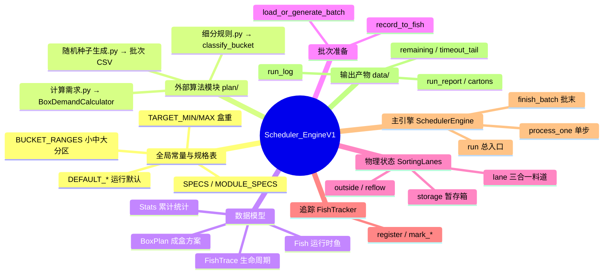

---

## 二、全局变量与常量

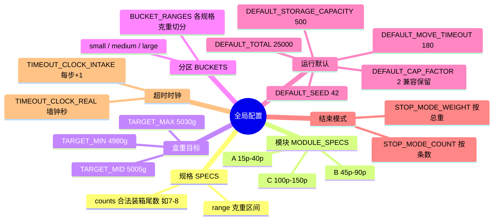

| 变量 | 职责 |
|------|------|
| `SPECS` | 18 规格字典：`range` 单尾克重区间，`counts` 合法成盒尾数元组 |
| `MODULE_SPECS` | 三大模块各自包含的 6 个规格 |
| `DEFAULT_ENABLED_SPECS` | 默认启用规格（当前 15p–40p） |
| `BUCKET_RANGES` | 启动时按 `细分规则.py` 预计算各规格小/中/大克重区间 |
| `BoxDemandCalculator` | 从 `计算需求.py` 动态加载，判定入道/封箱 |

---

## 三、数据模型脑图

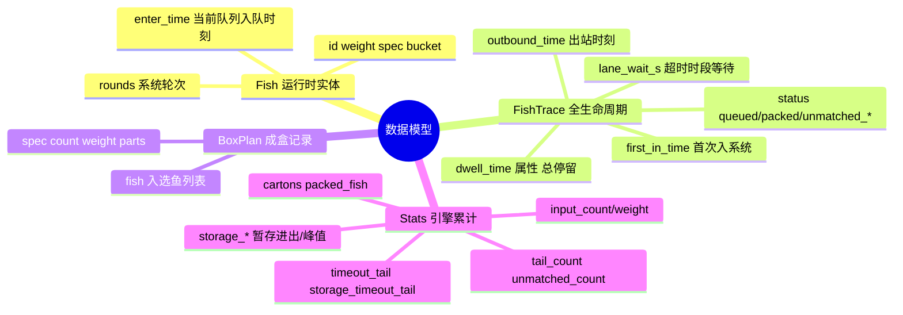

### 关键时间语义

| 字段 | 含义 | 何时写入/重置 |
|------|------|----------------|
| `Fish.enter_time` | 进入**当前队列**的时刻 | 入料道/暂存/出队变队首时重置 |
| `FishTrace.first_in_time` | **首次**进入系统 | `register()` 首次登记，不再变 |
| `_fish_system_dwell()` | 超时判定用 | `tick - first_in_time`（料道↔暂存不重置） |

---

## 四、工具函数分层

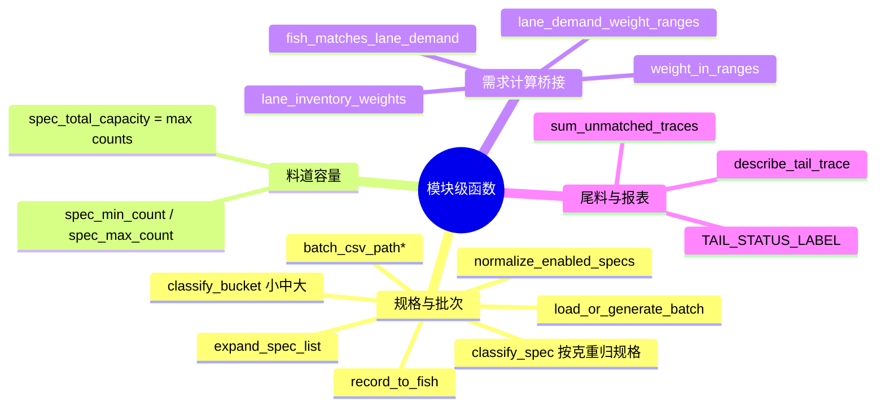

| 函数 | 输入 → 输出 | 职责 |
|------|-------------|------|
| `lane_inventory_weights` | `SortingLanes, spec` → 克重列表 | 料道当前鱼重量（不含暂存） |
| `lane_demand_weight_ranges` | 料道状态 → `[(lo,hi),…]` | 下一条可进鱼的克重区间 |
| `fish_matches_lane_demand` | `Fish` → bool | `BoxDemandCalculator.check_incoming_fish` |
| `record_to_fish` | CSV 记录 → `Fish` | 赋 spec/bucket/enter_time |
| `load_or_generate_batch` | seed/total/规格 → 记录列表 | 读缓存或 `随机种子生成.py` 生成 |

---

## 五、`FishTracker` 脑图

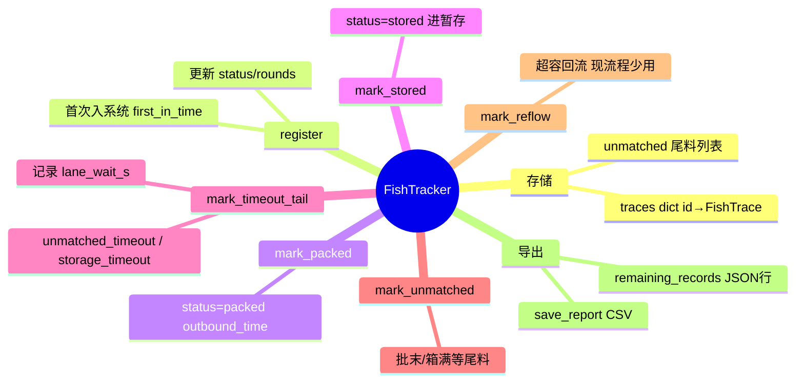

| 方法 | 职责 |
|------|------|
| `register` | 鱼首次入系统或更新轮次/状态 |
| `mark_packed` | 封箱成功，写 `outbound_time` |
| `mark_stored` | 进入暂存箱 |
| `mark_timeout_tail` | 超时淘汰，记入 `unmatched` |
| `mark_unmatched` | 批末/箱满等尾料 |
| `save_report` | 导出 `run_report_seed_*.csv` |
| `remaining_records` | 尾料 JSON 行，供前端/API |

---

## 六、`SortingLanes` 物理状态脑图

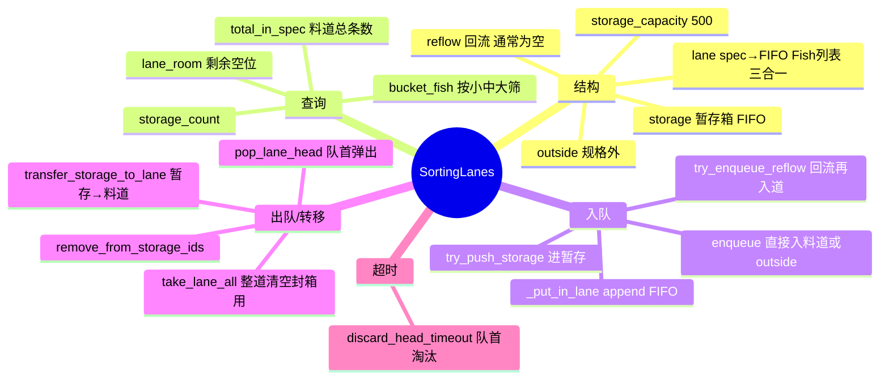

### 料道容量公式

```
spec_total_capacity(spec) = max(SPECS[spec]["counts"])
例：15p counts=(7,8) → 料道最多 8 条（三合一合计，不分小中大容量）
```

| 方法 | 职责 |
|------|------|
| `lane_room` | `cap - total_in_spec`，是否有空位 |
| `enqueue` | 规格内 append 料道 / 规格外进 outside |
| `try_push_storage` | 暂存未满则入箱，写 `enter_time` |
| `transfer_storage_to_lane` | 按候选顺序从暂存移入料道 |
| `take_lane_all` | 封箱时清空整道 |
| `discard_head_timeout` | 队首超时弹出并记尾料 |

---

## 七、`SchedulerEngine` 方法脑图

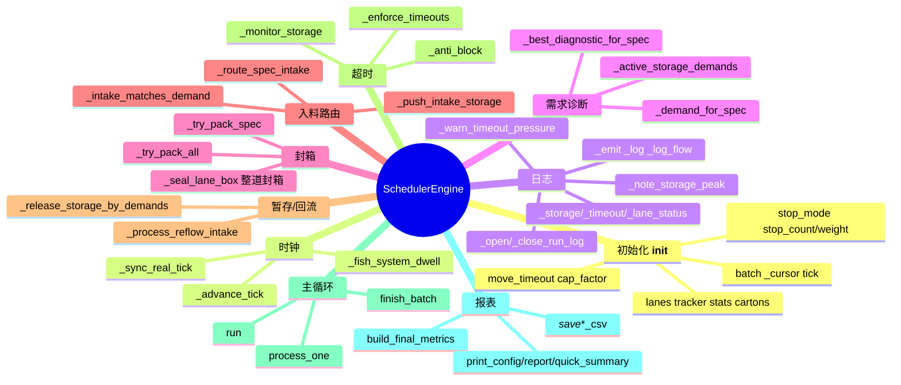

### `SchedulerEngine` 实例变量

| 变量 | 职责 |
|------|------|
| `batch` / `_cursor` / `total_fish` | 预加载批次与读取游标 |
| `tick` | 仿真时钟（步或秒） |
| `lanes` | 料道 + 暂存 + 规格外物理状态 |
| `tracker` | 每条鱼生命周期 |
| `stats` | 全局计数器 |
| `cartons` | 已成盒 `BoxPlan` 列表 |
| `move_timeout` | 系统累计停留超时阈值 |
| `timeout_tail_log` | 超时鱼明细，导出 CSV |
| `finished` | 批末是否完成 |

---

## 八、核心运行流程（总入口）

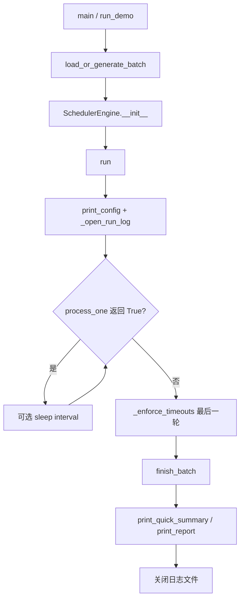

---

## 九、`process_one()` 单步详细流程

**每步处理批次中恰好 1 条鱼**，是仿真的心脏。

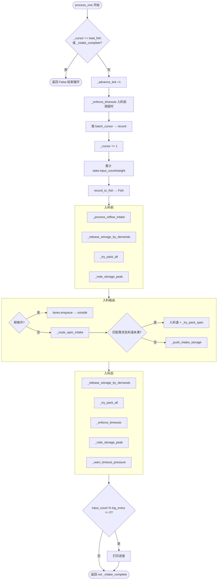

### 9.1 `_route_spec_intake` 决策树

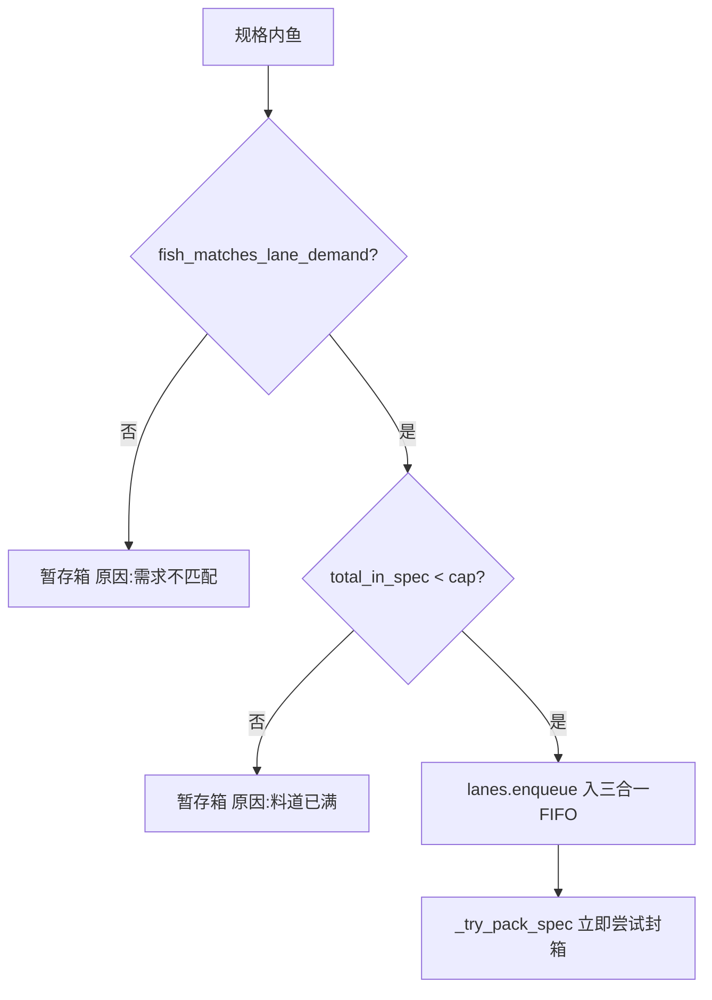

### 9.2 `_seal_lane_box` 封箱逻辑

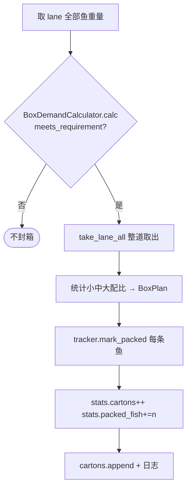

> **无 DFS**：料道鱼一旦 `meets_requirement`，整道 FIFO 全部成盒。

### 9.3 `_release_storage_by_demands` 暂存出库

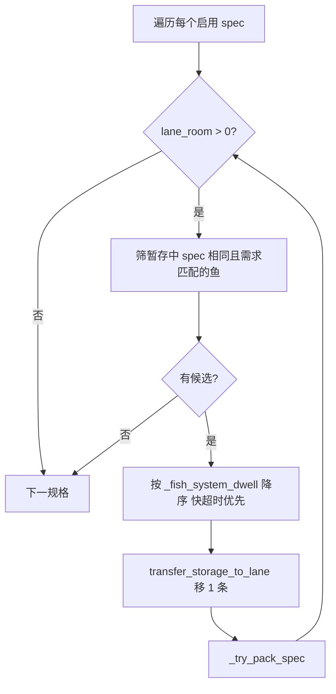

### 9.4 超时处理 `_enforce_timeouts`

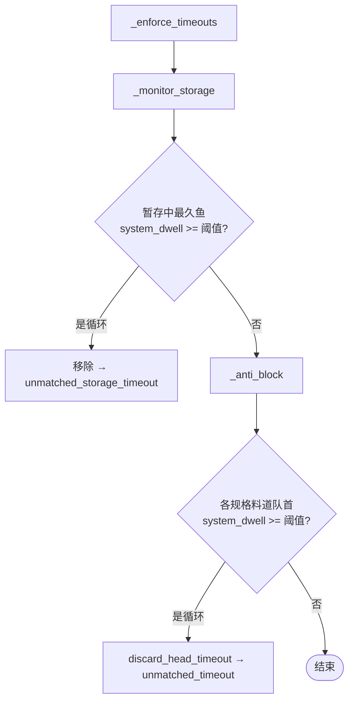

**超时语义**：以 `first_in_time` 起的**系统累计停留**判定；日志同时记录 `lane_wait_s`（本次队列等待）。  
同一步内用 `while` 循环清完所有已超时鱼，避免积压。

---

## 十、`finish_batch()` 批末流程

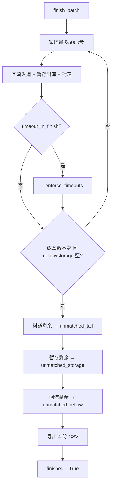

| 批末产物 | 路径 | 内容 |
|----------|------|------|
| `run_report_seed_*.csv` | `tracker.save_report` | 全批次鱼生命周期 |
| `cartons_seed_*.csv` | `_save_cartons_csv` | 成盒明细 |
| `remaining_seed_*.csv` | `_save_remaining_csv` | 尾料明细 |
| `timeout_tail_seed_*.csv` | `_save_timeout_tail_csv` | 超时鱼明细 |

默认 `timeout_in_finish=False`：批末扫尾阶段**不继续超时淘汰**，剩余鱼直接标为批末尾料。

---

## 十一、鱼在系统中的状态流转

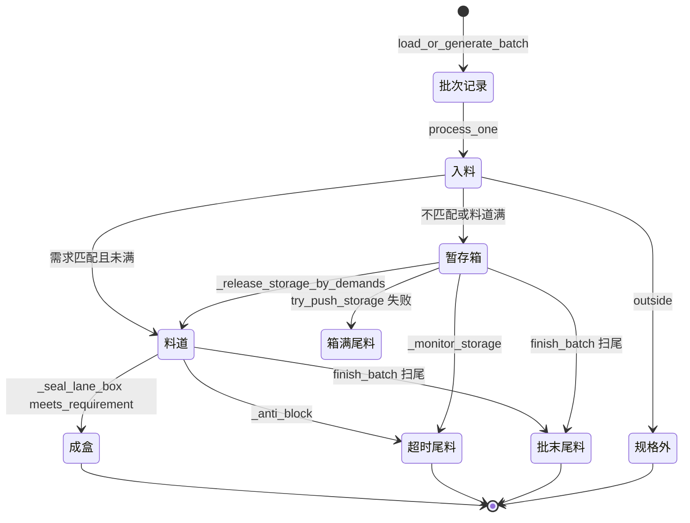

---

## 十二、方法职责速查表

### 批次层

| 方法 | 职责 |
|------|------|
| `batch_total_for_run` | 按总重模式估算需预生成条数上限 |
| `load_or_generate_batch` | 读/写 `fish_seed_*.csv` 或按重生成 |
| `record_to_fish` | CSV 行 → 运行时 `Fish` |

### `SchedulerEngine` 核心业务

| 方法 | 调用时机 | 职责 |
|------|----------|------|
| `process_one` | 主循环每步 | 驱动整条流水线 |
| `_route_spec_intake` | 入料 | 需求匹配路由 |
| `_try_pack_all` | 入料前/后 | 全规格尝试封箱 |
| `_release_storage_by_demands` | 入料前/后 | 暂存按需求+快超时出库 |
| `_enforce_timeouts` | 入料前/后/批末 | 清暂存+料道超时 |
| `finish_batch` | 入料结束 | 扫尾封箱+标尾料+写 CSV |
| `build_final_metrics` | 报表 | 汇总装箱率/超时/峰值 |

### 入口

| 方法 | 职责 |
|------|------|
| `run` | `while process_one` → `finish_batch` → 打印结果 |
| `run_demo` | 封装加载批次+创建引擎+运行 |
| `main` | CLI 参数解析 → 创建 `SchedulerEngine` |

---

## 十三、单步时序（文字版）

以一条**规格内、需求匹配**的鱼为例：

```
tick+1
  → 入料前清超时（暂存最久 + 各料道队首）
  → 读 record #N，转 Fish，累计入料统计
  → 回流队列尝试再入道（通常空）
  → 暂存箱：有空位则按需求+快超时逐条出到料道，每条出完尝试封箱
  → 全规格扫描封箱（料道达标则整道成盒）
  → 记录暂存峰值
  → 本鱼：需求匹配且料道未满 → append 料道 FIFO → 本规格再封箱
  → 暂存再出库一轮 + 再封箱
  → 再清超时 + 峰值 + 超时预警（verbose）
  → 每 500 条打进度日志
```

以一条**需求不匹配**的鱼为例：

```
…（入料前同上）…
  → 本鱼：不匹配 → try_push_storage
       成功：stats.storage_in++，status=stored
       失败：mark_unmatched storage_full
…（入料后同上）…
```

---

## 十四、与 `plan/计算需求.py` 的衔接

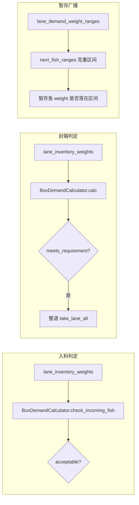

---

## 十五、进鱼随机生成（`plan/随机种子生成.py`）

| 变量/参数 | 默认值 | 含义 |
|-----------|--------|------|
| `DEFAULT_OUTSIDE_RATE` | `0.01` | 约 **1%** 超规鱼 |
| `DEFAULT_SEED` | `42` | 随机种子，可复现 |
| `enabled_specs` | 如 module-a 6 规格 | 仅在这些规格内生成「规格内鱼」 |

**规格内鱼**：在启用规格中等概率选一档，克重在 `range` 内均匀随机。  
**超规鱼**：低于/高于启用区间，或落在未启用规格区间。  
生成后 `shuffle` 打乱顺序，赋 `id=1..N`。

---

## 十六、CLI 常用参数

```bash
# 快速跑 10 吨
python Scheduler_EngineV1.py --fast --seed 42 -w 10 --move-timeout 240 --specs module-a

# 按条数 + 完整报告
python Scheduler_EngineV1.py --fast -n 3000 --report -v

# 批末继续超时淘汰（旧行为）
python Scheduler_EngineV1.py ... --timeout-in-finish

# 指定运行日志
python Scheduler_EngineV1.py --log-file data/my_run.log ...
```

| 参数 | 含义 |
|------|------|
| `--seed` | 随机种子 |
| `--specs` | 启用规格，逗号分隔或 `module-a/b/c` |
| `--move-timeout` | 超时阈值（步或秒，见 `--timeout-clock`） |
| `-n` / `-w` | 按条数 / 按总重（吨）结束 |
| `--fast` | 不 sleep、静默、单行结果 |
| `-v` | 详细流向日志 |
| `--report` | 批末完整汇总 |
| `--timeout-in-finish` | 批末扫尾是否继续超时淘汰 |

---

*文档与 `Scheduler_EngineV1.py` 同步维护；料道结构为三合一单 FIFO，封箱无 DFS。*
