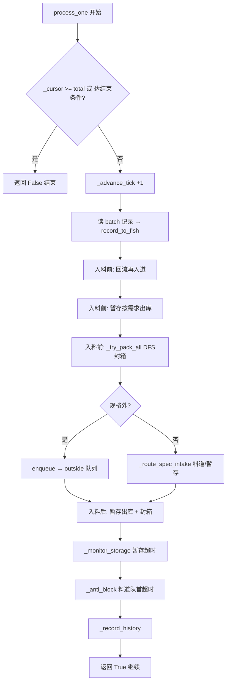

# 纯算 `Scheduler_EngineV1.py` 算法全流程说明

基于 [`Scheduler_Engine.py`](Scheduler_Engine.py) 及 `plan/` 子模块整理，便于对照业务预想。

---

## 一、总览：单步 `process_one()` 流水线



### 核心入口方法

| 方法 | 作用 |
|------|------|
| `process_one()` | 每步处理批次中**一条**鱼，驱动全流程 |
| `finish_batch()` | 批末继续封箱/出库，料道/暂存/回流剩余标尾料，写 CSV |
| `load_or_generate_batch()` | 按种子生成或加载 `fish_seed_*.csv` |

---

## 二、进鱼如何随机生成（`plan/随机种子生成.py`）

### 2.1 生成规则

| 变量/参数 | 默认值 | 含义 |
|-----------|--------|------|
| `DEFAULT_OUTSIDE_RATE` | `0.01` | 约 **1%** 超规鱼 |
| `DEFAULT_SEED` | `42` | 随机种子，可复现 |
| `enabled_specs` | 如 module-a 6 规格 | 仅在这些规格内生成「规格内鱼」 |

**规格内鱼** `_random_inside_weight()`：

1. `spec = rng.choice(enabled_specs)` — **在启用规格中等概率选一档**（不是按需求加权）
2. `weight = rng.randint(lo, hi)` — 在该规格克重区间内均匀随机

**超规鱼** `_random_outside_weight()`（相对启用规格）：

- 低于启用区间下沿 / 高于上沿 / 落在**未启用**规格的区间，三策略随机

生成后 `rng.shuffle` 打乱顺序，再赋 `id=1..N`。

### 2.2 与预想对照

| 你的预想 | 实际 |
|----------|------|
| 按规格随机 | ✅ 规格内：启用规格**等概率** |
| 1% 超规 | ✅ 默认 1% |

**批次鱼到达顺序固定**；算法**不会**因为「某规格缺鱼」而改变下一条的 `spec`。

---

## 三、超时如何设置与计算

### 3.1 配置变量

| 变量 | 默认 | 含义 |
|------|------|------|
| `move_timeout` | `30` | 队首/暂存最久等待阈值 |
| `timeout_clock` | `"intake"` | 计时方式 |
| `TIMEOUT_CLOCK_INTAKE` | 每 `process_one` 一步 `tick += 1` | 单位：**步** |
| `TIMEOUT_CLOCK_REAL` | `tick = 墙钟秒` | 单位：**秒** |

### 3.2 `Fish.enter_time` 语义（关键）

| 场景 | `enter_time` 何时写入/重置 |
|------|---------------------------|
| 首次入系统 | 入料道/暂存/outside 时设为当前 `tick` |
| 成为某分区**新队首** | `_sync_head_enter_time` 重置为当前 `tick` |
| 回流再入道 | `rounds += 1`，`enter_time` 重置 |
| 暂存 → 料道 | `enter_time` 重置 |

**超时只统计「担任队首期间」或「在暂存箱内」的等待**，不是从首次进系统算起。

### 3.3 料道超时 `_anti_block()`

```python
if tick - lane[0].enter_time >= move_timeout:
    discard_head_timeout()  # → unmatched_timeout，不进回流
```

- 每步**只处理第一条**超时队首（`return` 退出）
- `move_timeout <= 0` 则**关闭**超时淘汰

### 3.4 暂存超时 `_monitor_storage()`

```python
fish = min(storage, key=enter_time)  # 等待最久的
if tick - fish.enter_time >= move_timeout:
    → unmatched_storage_timeout
```

- 同样每步最多淘汰 **1 条**
- 日志含 `lane_wait_s`（暂存内等待）、`system_dwell_s`（从 `first_in_time` 起全系统停留）

### 3.5 与预想对照

| 预想 | 实际 |
|------|------|
| 超时 = 队首等待 | ✅ 料道按队首 `enter_time` |
| 超时鱼进回流 | ❌ **直接尾料**，`discard_head_timeout` 不进 `reflow` |
| 暂存也有超时 | ✅ 独立监控暂存最久者 |

---

## 四、料道尺寸与容量

### 4.1 结构

每个**启用规格**一组 **三合一料道**（不按小/中/大分别限容）：

```
lanes.queues[spec] = {
  "small":  FIFO list,
  "medium": FIFO list,
  "large":  FIFO list,
}
```

### 4.2 容量公式

| 函数 | 公式 | 15p 示例 (counts=(7,8), cap_factor=1) |
|------|------|--------------------------------------|
| `spec_min_count(spec)` | `min(SPECS[spec]["counts"])` | 7 |
| `spec_total_capacity(spec, cap_factor)` | `min(counts) + cap_factor` | **8** |
| `lane_capacity(spec, cap_factor)` | `ceil(total_cap / 3)` | 3（仅 UI 参考） |

**判定超容**：`total_in_spec(spec) >= spec_total_capacity`  
即小+中+大**合计**条数，不是单路容量。

### 4.3 小/中/大分区（`plan/细分规则.py`）

对每规格用 `calc_bucket_split(spec_range, primary_count)`：

- `primary_count` = 该规格 `counts` 中间值（如 15p→8 尾）
- **中区**锚定：单尾落在 `[ceil(4980/count), floor(5030/count)]`
- 小 = 规格下沿 ~ 中区下沿-1；大 = 中区上沿+1 ~ 规格上沿

入料时用 `bucket_of(weight, BUCKET_RANGES[spec])` 决定进哪路 FIFO。

### 4.4 与预想对照

| 预想 | 实际 |
|------|------|
| 料道不会超容 | ⚠️ **会达到容量上限**（8 条/规格默认）；超容后**不进回流**，改走暂存或腾位 |
| 每路独立容量 | ❌ **三合一总容量**，单路可超过 `lane_capacity` 显示值 |
| 料道 = 物理 FIFO | ✅ 每分区队尾入、队头出/超时/腾位 |

---

## 五、DFS 封箱何时生效（`BoxPlanner.find_plan` + `plan/深度搜索.py`）

### 5.1 触发条件

在 `_try_pack_all()` → `_try_pack_spec()` 中**循环调用**，直到无解：

1. `total_available_for_spec >= min(counts)`（料道+暂存合计够最小尾数）
2. 构建搜索窗口 `_dfs_search_buffer()`：
   - **先** `storage_for_spec(spec)` 全部暂存鱼
   - 料道+暂存 ≤ `dfs_max_buffer_for_spec` → 料道三路全取
   - 否则每路只取队头 `dfs_window_per_bucket_for_spec` 条（默认 max(15, buffer/3)）
3. `dfs_find_best_from_items()`：
   - 尾数 ∈ `SPECS[spec]["counts"]`
   - 总重 ∈ **[4980, 5030]g**
   - 访问节点 > `DFS_MAX_NODES` 或 buffer > `max_buffer` → **放弃 DFS，返回 None**
4. 成功 → `BoxPlan(pick_ids=...)` 按 ID 从料道+暂存精确移除（**非队头前缀**）

### 5.2 与 FIFO 队头法

`fifo_head_find_from_items` 仅作回退思路；**引擎主路径是 DFS 自由组合**。

### 5.3 与预想对照

| 预想 | 实际 |
|------|------|
| 满 min 尾数才搜 | ✅ |
| 暂存鱼参与配盒 | ✅ **且排在搜索窗口前面** |
| 任意子集组合 | ✅ DFS；积压时窗口截断 |
| 每步必封箱 | ❌ 无解则本步该规格不封 |

---

## 六、需求计算：算不算「下一条鱼的规格」？

### 6.1 `BoxDemandCalculator`（`plan/计算需求.py`）

输入：**当前料道+暂存**该规格已有鱼的克重列表（不是虚拟「下一箱」）。

输出：

- `next_fish_ranges`：**下一条**可接受的**克重区间**（可合并多段）
- **不算下一条鱼的 spec** — spec 已由批次 `record.spec` 决定

计算逻辑（已有鱼 `count>0` 时）：

- 对每个合法目标尾数 `target_count`：
  - `remaining = target_count - count`
  - `rem_min/max = TARGET_MIN/MAX - current_weight`
  - `next_fish_range_for_remaining()` 推算下一条克重范围
- 合并所有可行方案的区间 → `next_fish_ranges`

### 6.2 需求广播 `collect_demands()`

对 18 规格各生成一条广播（含未启用规格，priority=9 inactive）：

| `weight_ranges` 来源 | 函数 |
|---------------------|------|
| 料道+暂存合并库存 | `spec_demand_weight_ranges()` → `BoxDemandCalculator` |
| 满容仍无解 | `diagnostic_need_weight_ranges()` 偏轻→要大区、偏重→要小区 |

活跃优先级示例：

- priority 2：不足（料道 < min counts）
- priority 3：偏轻/偏重/等待
- priority 4：可装（inactive）或监控

### 6.3 入料是否「按需求进鱼」？

**部分按需求，spec 不能选：**

`_route_spec_intake(fish)` 决策树：

```
cap = min(counts) + cap_factor
min_cnt = min(counts)
total = 料道条数
matches = weight 落在 _intake_weight_ranges(spec) 内

① total < min_cnt  OR (total < cap AND matches)  → 直接入料道
② total < cap AND NOT matches                   → 暂存（原因："需求不匹配"）
③ matches AND _make_room_for_intake 成功        → 入料道
④ 其余                                          → 暂存（原因："料道已满"）
```

`_intake_weight_ranges` 只用**料道内**鱼（不含暂存）算需求；暂存鱼通过 `_release_storage_by_demands` 单独出库。

### 6.4 与预想对照

| 预想 | 实际 |
|------|------|
| 需求决定下一条 spec | ❌ spec 来自批次 |
| 需求决定克重是否入道 | ✅ `matches` 决定直接入道 vs 暂存 |
| 需求含暂存库存 | ✅ 广播/封箱用料道+暂存；入料路由用料道 only |

---

## 七、「超容」在什么情况触发？

当前版本**料道超容不再弹队头到回流队列**（`divert_head` 仍存在但主路径不用）。

### 7.1 实际超容处理路径

| 场景 | 行为 | 统计/日志 |
|------|------|-----------|
| 料道已满 + 鱼匹配需求 | `_make_room_for_intake`：先封箱，再弹某路队头 → **暂存** | `overflow_reflow_log`，destination=`storage` |
| 料道已满 + 不匹配 / 腾位失败 | `_push_intake_storage` | `storage_in`，原因「料道已满」 |
| 料道已满 + 不匹配 | 直接暂存 | 原因「需求不匹配」 |
| 暂存已满 | `unmatched_storage_full` 尾料 | `storage_full_tail` |

`stats.overflow_reflow` 字段**当前未被递增**；腾位暂存记在 `overflow_reflow_log`。

### 7.2 与预想对照

| 预想 | 实际 |
|------|------|
| 料道不超容 | ❌ 有硬上限 `min(counts)+cap_factor` |
| 超容 → 回流 | ❌ 主路径 → **暂存** 或尾料 |
| 超容回流统计 | ⚠️ 日志有，计数器 `overflow_reflow` 可能恒为 0 |

---

## 八、暂存箱：只有「未匹配」才进？

**否。暂存接受多种情况：**

| 入暂存原因 | 触发点 | 状态 |
|------------|--------|------|
| 需求不匹配 | `_route_spec_intake` | `stored` |
| 料道已满 | `_route_spec_intake` | `stored` |
| 腾位换路 | `_make_room_for_intake` → `divert_head_to_storage` | `stored` |
| 暂存已满 | `_push_intake_storage` 失败 | `unmatched_storage_full` |

**不会进暂存：**

- 规格外 → `outside` 队列
- 料道超时 → 直接 `unmatched_timeout`（不进暂存）
- 正常匹配且有空位 → 直接入料道

默认 `storage_capacity = 150` 条（全规格共用一箱）。

### 8.1 暂存鱼何时回到料道？

`_release_storage_by_demands()`（入料前+入料后各一次）：

- 遍历 `collect_demands()` 中 `active` 且 `priority <= 3` 的需求
- 按 `weight_ranges` 从暂存**非 FIFO 队头**取鱼（`enter_time` 最久优先）
- `transfer_storage_for_spec` → 落入对应小/中/大分区
- 受料道剩余容量 `cap - total_in_spec` 限制

**封箱时**：`BoxPlanner` 搜索窗口**优先包含暂存鱼**，可直接从暂存成盒（`storage_packed` 统计）。

### 8.2 暂存超时鱼是否「优先」配盒？

- **出库入道**：按活跃需求区间匹配，**不是**超时者优先
- **DFS 配盒**：暂存鱼在 buffer **前面**，但按重量组合最优，**不专门优先超时鱼**
- **暂存超时**：等待 ≥ `move_timeout` 的**最久者**先被淘汰为尾料

### 8.3 与预想对照

| 预想 | 实际 |
|------|------|
| 仅未匹配进暂存 | ❌ 还有满容、腾位、需求不匹配 |
| 暂存只出不进其他情况 | ❌ 可封盒直出、可超时尾料 |
| 超时暂存鱼优先配盒 | ⚠️ 优先参与 DFS 窗口，但无超时权重 |

---

## 九、回流队列 `reflow` 的现状

| 方法 | 现状 |
|------|------|
| `divert_head()` | 队头 → `reflow`，`rounds+=1`，原因 `overflow` |
| `_process_reflow_intake()` | 料道未满则 `try_enqueue_reflow` |
| 主路径 | 注释写明防堵已改暂存路由，**回流队列通常为空** |
| `finish_batch` | 剩余回流 → `unmatched_reflow` |

---

## 十、批末 `finish_batch()` 扫尾

1. 循环最多 5000 步：回流入道、暂存出库、封箱、暂存超时
2. 料道剩余 → `unmatched_tail`
3. 暂存剩余 → `unmatched_storage`（清空暂存）
4. 回流剩余 → `unmatched_reflow`
5. 写 `run_report / cartons / remaining / timeout_tail` CSV

---

## 十一、关键类与变量速查

| 名称 | 类型 | 说明 |
|------|------|------|
| `SPECS` | dict | 18 规格 `range` + `counts` |
| `TARGET_MIN/MAX` | 4980/5030 | 盒重目标（克） |
| `SchedulerEngine.batch` | list | 预加载 `FishRecord` |
| `_cursor` | int | 批次读取游标 |
| `tick` | int | 仿真时钟 |
| `lanes.queues` | dict | 规格→{small,medium,large} FIFO |
| `lanes.storage` | list | 暂存箱（append 入，按 ID/需求出） |
| `lanes.reflow` | list | 回流队列（现少用） |
| `lanes.outside` | list | 规格外 |
| `tracker.traces` | dict | 鱼 ID → `FishTrace` 全生命周期 |
| `FishTrace.first_in_time` | int | 首次进系统 tick |
| `FishTrace.lane_wait_s` | int | 超时时刻记录的等待时长 |
| `BoxPlan.pick_ids` | frozenset | DFS 选中鱼 ID，自由组合移除 |

---

## 十二、关键方法索引

| 方法 | 模块 | 作用 |
|------|------|------|
| `generate_fish_batch` | 随机种子生成 | 按条数生成批次 |
| `generate_fish_batch_by_weight` | 随机种子生成 | 按总重生成批次 |
| `calc_bucket_split` | 细分规则 | 小/中/大克重区间划分 |
| `BoxDemandCalculator.calc` | 计算需求 | 计算下一条鱼克重需求区间 |
| `dfs_find_best_from_items` | 深度搜索 | DFS 自由组合配盒 |
| `load_or_generate_batch` | Scheduler_Engine | 加载/生成 CSV 批次 |
| `record_to_fish` | Scheduler_Engine | 批次记录 → 运行时 Fish |
| `process_one` | Scheduler_Engine | 单步仿真主循环 |
| `_route_spec_intake` | Scheduler_Engine | 规格内鱼：料道 vs 暂存 |
| `_intake_weight_ranges` | Scheduler_Engine | 入料路由用动态需求区间 |
| `_make_room_for_intake` | Scheduler_Engine | 满容时封箱+腾位入暂存 |
| `_release_storage_by_demands` | Scheduler_Engine | 暂存按需求出库入道 |
| `BoxPlanner.find_plan` | Scheduler_Engine | DFS 搜索封箱方案 |
| `_try_pack_all` | Scheduler_Engine | 遍历启用规格封箱 |
| `_anti_block` | Scheduler_Engine | 料道队首超时 → 尾料 |
| `_monitor_storage` | Scheduler_Engine | 暂存最久等待超时 → 尾料 |
| `collect_demands` | Scheduler_Engine | 18 规格需求广播 |
| `finish_batch` | Scheduler_Engine | 批末扫尾 + 导出 CSV |

---

## 十三、与业务预想的总对照表

| 问题 | 预想倾向 | 纯算实现 | 一致？ |
|------|----------|----------|--------|
| 进鱼规格随机 | 随机 | 启用规格等概率 + 区间内随机克重 | ✅ |
| 按需求决定进哪种规格 | 可能期望定向 | 批次固定，需求只影响料道/暂存 | ❌ |
| 超时设置 | 队首等待 | `move_timeout` + intake/real 两种 tick | ✅ |
| 料道尺寸 | 可能无超容 | 三合一 `min(counts)+cap_factor` | ⚠️ |
| DFS 条件 | 够尾数+盒重 | + 窗口/节点上限 | ✅ |
| 需求算下一条 spec | — | 只算下一条**克重区间** | ⚠️ |
| 超容触发 | 料道不超容 | 满容→暂存/腾位，非回流 | ⚠️ |
| 暂存仅未匹配 | 仅未匹配 | 不匹配/满容/腾位均可进 | ❌ |
| 暂存超时优先配盒 | 优先 | 参与 DFS 窗口，无超时优先权 | ⚠️ |
| 超时实现 | — | 队首 `enter_time`，每步最多淘汰 1 条 | ✅ |

---

## 十四、若与预想不一致，建议改动点

| 目标 | 建议改动点 |
|------|------------|
| 料道永不满、只暂存 | 增大 `cap_factor` 或取消 `_route_spec_intake` 满容分支 |
| 暂存仅「需求不匹配」 | 删 `_make_room_for_intake` 腾位入暂存；满容直接尾料或拒收 |
| 超容仍走回流 | 恢复 `_anti_block` 中 `divert_head(reason="overflow")` |
| 按需求生成批次 spec | 改 `plan/随机种子生成.py`，与 `collect_demands` 联动 |
| 暂存超时鱼优先配盒 | DFS buffer 排序或 `_release_storage_by_demands` 加超时权重 |

---

## 十五、相关文件

| 文件 | 说明 |
|------|------|
| `Scheduler_Engine.py` | 主引擎 |
| `plan/随机种子生成.py` | 批次鱼生成 |
| `plan/计算需求.py` | 动态需求 / 下一条克重区间 |
| `plan/深度搜索.py` | DFS 配盒 |
| `plan/细分规则.py` | 小/中/大分区划分 |
| `batch_runner.py` | 纯算法批量测试入口 |


"""
python Scheduler_EngineV1.py --fast --seed 42 --specs 15p,20p,25p,30p,35p,40p -w 10 --move-timeout 180 --log-every 500 -v --exclude-outside-stats

python Scheduler_EngineV1.py --fast --seed 42 --specs 45p,50p,60p,70p,80p,90p -w 10 --move-timeout 300 -v --exclude-outside-stats

python Scheduler_EngineV1.py --fast --seed 42 --specs 100p,110p,120p,130p,140p,150p -w 10 --move-timeout 300 -v

"""

